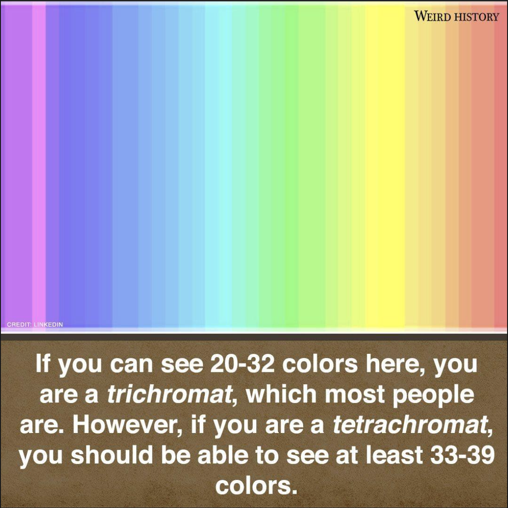

There is a meme going around social media which I saw the other day:

Supposedly, you have highly advanced vision if you can see 39 colors. I was immediately suspicious. Social media memes are usually wrong. As is my habit, I zoomed in on the image with great skepticism.

As I tried to hand-count the pinks from the left, I exceeded 15 and decided it would be better to run a script to figure out the color count, since this meme was proving to be incorrect.

You simply need to go through each pixel and check the color value. You can do this with Pillow, which is a fork of the Python Image Library (PIL). This is a great package for image processing and graphics. If you use anaconda, Pillow already comes bundled with it so there are no extra dependencies to deal with.

The following script can be used to process any image in order to get the color count.

`from PIL import Image`

`img = Image.open('/path/to/image', 'r')`

`pixel_list = list(img.getdata())`

`# Check the size of the pixel list`

`print('The size of the image is ', len(pixel_list), ' pixels.')`

`# Get the length of the set of unique values. This is the color count.`

`print('There are ' len(set(pixel_list)), ' unique colors in this image.')`

The script produces the following output:

`The size of the image is 1598508 pixels.`

`There are 47114 unique colors in this image.`

Super easy! Simply import PIL, open the image, and get the image data using Image.getdata(). This method returns a sequence of (r, g, b, a) values corresponding to each pixel. Convert this sequence into a list in order to perform operations on it, and then convert the list into a set in order to discard all duplicate colors.

I tested algorithm correctness by creating a solid-color image in Photoshop and processing that. You could make a more thorough test than that if you want, but it won't be necessary - this is just a quick and dirty script.

**The final tally?**

There are roughly 47,114 colors in the picture. Of course, this number is just an estimate. The actual number depends on file metadata and, if you didn't download it directly, the monitor used to take a screenshot. Since I’m using a 27” Retina 5k monitor, I have a far higher pixel density in my screenshots than many other monitors. As you can see in the output, over 1.5 million pixels were very rapidly processed from this image. Testing with a 27” 4k monitor, the number of unique colors is reduced to 28,564. With a laptop or regular HD monitor it would be reduced even further. The number also depends, to a much lesser extent, on how you cropped the image, but we can save the philosophical question of where the image actually begins for another day! 

To conclude, if you see more than 39 colors, you are most likely a developer or designer.